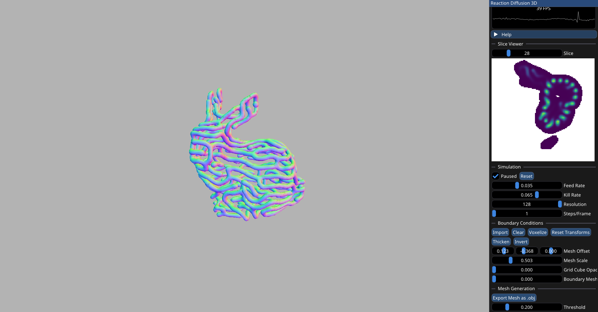
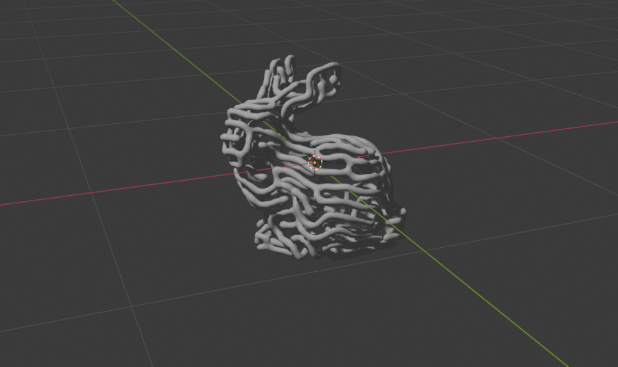
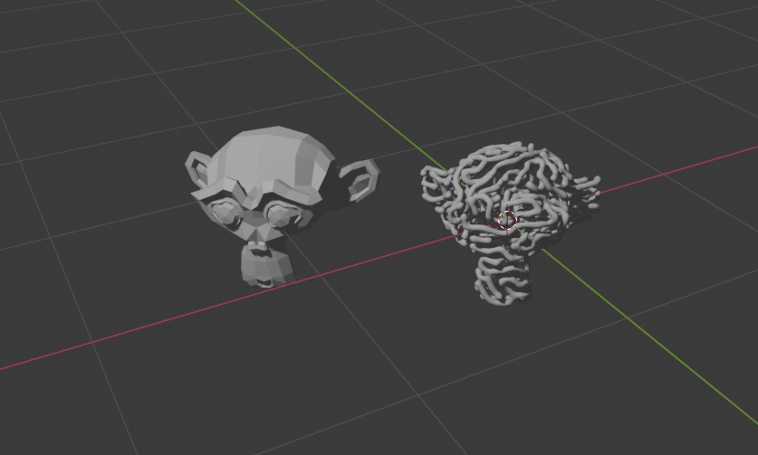

# Reaction Diffusion 3D

## Screenshots

### Attribution

#### Articles
- [Polygonising a Scalar Field](https://paulbourke.net/geometry/polygonise/) by Paul Bourke

#### Libraries
- [imgui](https://github.com/ocornut/imgui)
- [voxelizer](https://github.com/karimnaaji/voxelizer)
- [nativefiledialog](https://github.com/mlabbe/nativefiledialog)
- [tinyobjloader](https://github.com/tinyobjloader/tinyobjloader)
- [glfw](https://github.com/glfw/glfw)
- [glad](https://glad.dav1d.de/)
- [glm](https://github.com/g-truc/glm)